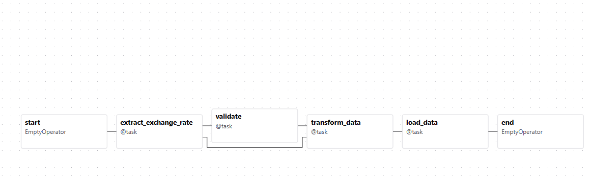
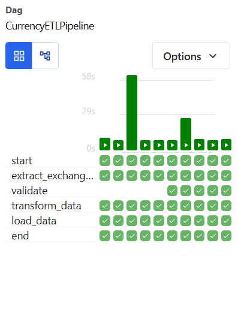
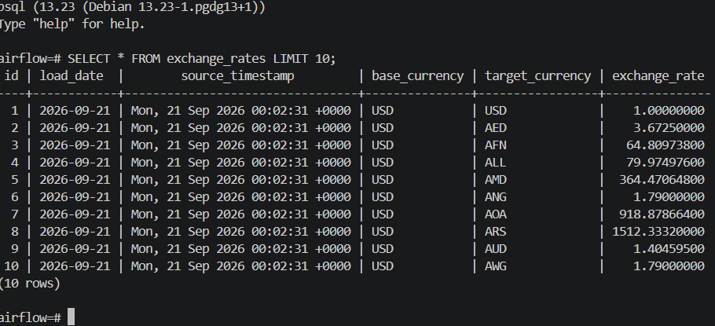

# Currency Exchange Rate ETL Pipeline using Apache Airflow

## Project Overview

This project is an end-to-end ETL (Extract, Transform, Load) pipeline built using **Apache Airflow**, **Python**, **PostgreSQL**, and **Docker**. The pipeline automatically retrieves daily currency exchange rates from the **Open Exchange Rates API (`open.er-api.com`)**, validates the raw API response, transforms the nested JSON data into a structured format, and loads it into a PostgreSQL database.

The project follows a modular ETL architecture by separating the Extract, Validate, Transform, and Load stages into independent modules. It includes data validation, record-level quality checks, structured logging using Python's logging module, and idempotent database loading through PostgreSQL unique constraints and `ON CONFLICT DO NOTHING`.

This project was developed to gain practical experience with Airflow workflow orchestration, REST API integration, data validation, data transformation, PostgreSQL, and production-oriented ETL pipeline design.


## Features

* Extracts daily currency exchange rates from the Open Exchange Rates API (`open.er-api.com`).
* Stores the original API response as raw JSON for traceability.
* Validates the API response before processing to ensure required fields and data types are correct.
* Performs record-level validation during transformation by skipping invalid exchange rates while continuing to process valid records.
* Transforms nested JSON data into a structured format suitable for relational databases.
* Stores transformed data as processed JSON.
* Loads processed data into PostgreSQL using bulk inserts (`executemany`) for efficient database operations.
* Prevents duplicate records using PostgreSQL unique constraints and `ON CONFLICT DO NOTHING`, making the pipeline idempotent.
* Generates transformation and loading summaries for monitoring data quality and pipeline execution.
* Uses Python's logging module to produce structured Airflow logs.
* Implements a modular ETL architecture with separate Extract, Validate, Transform, Load, and Utility components.
* Orchestrates the complete workflow using Apache Airflow's TaskFlow API.
* Containerized using Docker for a consistent and reproducible development environment.


## ETL Pipeline Architecture

```text
                   +-------------------------+
                   | Open Exchange Rates API |
                   +-----------+-------------+
                               |
                               v
                     +------------------+
                     | Extract Task     |
                     | Fetch API Data   |
                     +--------+---------+
                              |
                              v
                     +------------------+
                     | Raw JSON File    |
                     +--------+---------+
                              |
                              v
                     +------------------+
                     | Validate Task    |
                     | Schema Validation|
                     +--------+---------+
                              |
                              v
                     +------------------+
                     | Transform Task   |
                     | Data Cleaning &  |
                     | Record Validation|
                     +--------+---------+
                              |
                              v
                     +------------------+
                     | Processed JSON   |
                     +--------+---------+
                              |
                              v
                     +------------------+
                     | Load Task        |
                     | PostgreSQL       |
                     +--------+---------+
                              |
                              v
                     +------------------+
                     | exchange_rates   |
                     | Database Table   |
                     +------------------+
```

## Workflow

The pipeline is orchestrated using Apache Airflow's TaskFlow API and consists of four main stages:

### 1. Extract

* Fetches the latest exchange rates from the Open Exchange Rates API.
* Saves the complete API response as a raw JSON file.
* Passes the raw file path to downstream tasks through Airflow.

### 2. Validate

* Verifies that all required fields are present (`base_code`, `time_last_update_utc`, and `rates`).
* Confirms that each field has the expected data type.
* Ensures that required values are not empty.
* Stops the pipeline immediately if the dataset fails validation.

### 3. Transform

* Reads the validated raw JSON file.
* Converts the nested `rates` dictionary into one record per currency.
* Performs record-level validation by skipping:

  * `None` exchange rates
  * Non-numeric exchange rates
  * Zero or negative exchange rates
* Generates a transformation summary showing:
  * Total records
  * Valid records
  * Skipped records by reason
* Saves the cleaned data as a processed JSON file.

### 4. Load

* Reads the processed JSON file.
* Creates the `exchange_rates` table automatically if it does not already exist.
* Performs bulk insertion into PostgreSQL using `executemany()`.
* Prevents duplicate records using a unique constraint together with `ON CONFLICT DO NOTHING`.
* Generates a loading summary showing:

  * Records received
  * Records inserted
  * Duplicate records skipped


## Folder Structure

```text
CurrencyETLPipeline/
│
├── dags/
│   └── currency_pipeline.py
│
├── include/
│   ├── extract/
│   │   └── api_client.py
│   ├── validate/
│   │   └── validator.py
│   ├── transform/
│   │   └── transform_rates.py
│   ├── load/
│   │   ├── database.py
│   │   └── loader.py
│   └── utils/
│       └── file_utils.py
│
├── output/
│   ├── raw/
│   └── processed/
│
├── docker-compose.yaml
├── Dockerfile
├── requirements.txt
└── README.md
```

# Screenshots
### Airflow DAG Graph



### Airflow Grid View


### PostgreSQL Data



## Technologies Used
- Apache Airflow 3.x
- Python 3.12
- PostgreSQL
- Docker & Docker Compose
- REST API (Open Exchange Rates API)
- JSON


## Database Schema
The pipeline stores exchange rates in the `exchange_rates` table.

```sql
CREATE TABLE IF NOT EXISTS exchange_rates(
    id SERIAL PRIMARY KEY,
    load_date DATE,
    source_timestamp TEXT,
    base_currency VARCHAR(10),
    target_currency VARCHAR(10),
    exchange_rate NUMERIC(20,8),
    UNIQUE(load_date,base_currency,target_currency)
    );
```

## How to Run
1. Clone the repository.
2. Start the services:

```bash
docker compose up -d
```

3. Open Airflow:

```
http://localhost:8080
```

4. Enable the `CurrencyETLPipeline` DAG.

5. Trigger the DAG manually or wait for the scheduled run.

6. Verify the loaded data in PostgreSQL.

## Future Improvements

- Add automated email notifications on DAG failure.
- Implement incremental loading.
- Store API configuration using Airflow Variables or Connections.
- Add data quality checks using dedicated validation tasks.
- Add unit tests for Extract, Validate, Transform, and Load modules.

## Author

**Sujeeta Rijal**

BSc CSIT | Aspiring Data Engineer

