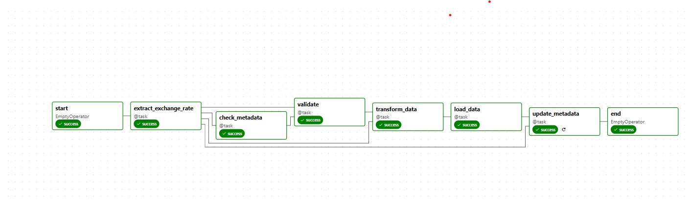
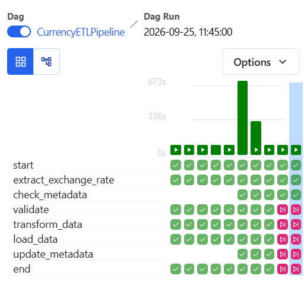

# Currency Exchange Rate ETL Pipeline using Apache Airflow
A production-inspired ETL pipeline built with Apache Airflow 3, PostgreSQL, and Docker that extracts, validates, transforms, and loads daily currency exchange rates while supporting idempotent and incremental data loading.

## Project Overview

This project is an end-to-end ETL (Extract, Transform, Load) pipeline built using **Apache Airflow**, **Python**, **PostgreSQL**, and **Docker**. The pipeline automatically retrieves daily currency exchange rates from the **Open Exchange Rates API (`open.er-api.com`)**, validates the raw API response, transforms the nested JSON data into a structured format, and loads it into a PostgreSQL database.

The project follows a modular ETL architecture by separating the Extract, Validate, Transform, and Load stages into independent modules. It includes data validation, record-level quality checks, structured logging using Python's logging module, and idempotent database loading through PostgreSQL unique constraints and `ON CONFLICT DO NOTHING`.

This project was developed to gain practical experience with Apache Airflow workflow orchestration, REST API integration, data validation, PostgreSQL, Docker, and production-oriented ETL pipeline design. The latest version implements incremental loading using an ETL metadata table and Airflow's @task.short_circuit decorator, allowing the pipeline to skip unnecessary downstream tasks when the source data has not changed.


## Features

* Extracts daily currency exchange rates from the Open Exchange Rates API (open.er-api.com).
* Stores both raw and processed JSON files for traceability.
* Validates API responses and performs record-level data quality checks.
* Transforms nested JSON into a relational format suitable for PostgreSQL.
* Loads data efficiently using bulk inserts (executemany).
* Prevents duplicate records using PostgreSQL unique constraints and ON CONFLICT DO NOTHING (idempotent loading).
* Implements incremental loading using an ETL metadata table and API timestamp comparison.
* Automatically skips downstream ETL tasks when no new source data is available using Airflow's TaskFlow Short Circuit.
* Uses structured logging for monitoring and debugging.
* Follows a modular ETL architecture with separate Extract, Validate, Transform, Load, and Utility modules.
* Orchestrates the workflow using Apache Airflow's TaskFlow API.
* Containerized with Docker for a reproducible development environment.


## ETL Pipeline Architecture

```text
                  Open Exchange Rates API
                            │
                            ▼
                      Extract Task
                            │
                            ▼
                      Raw JSON File
                            │
                            ▼
                  Check Metadata Task
                            │
                      ┌─────┴─────┐
                      │           │
                  New Data?     No New Data
                      │              │
                    Yes              │
                      ▼              ▼
                  Validate       Pipeline Ends
                      │
                      ▼
                  Transform
                      │
                      ▼
                  Processed JSON
                      │
                      ▼
                  Load Task
                      │
                      ▼
                  exchange_rates Table
                      │
                      ▼
                  Update Metadata Table
```


## Workflow

The pipeline is orchestrated using Apache Airflow's TaskFlow API and consists of six main stages:

### 1. Extract

* Fetches the latest exchange rates from the Open Exchange Rates API.
* Saves the complete API response as a raw JSON file.
* Passes the raw file path to downstream tasks through Airflow.

### 2. Metadata check

* Creates the metadata table automatically if it does not exist.
* Reads the API update timestamp.
* Retrieves the last successfully processed timestamp from PostgreSQL.
* Compares both timestamps.
* Skips downstream tasks when no new source data is available.
 
### 3. Validate

* Verifies that all required fields are present (`base_code`, `time_last_update_utc`, and `rates`).
* Confirms that each field has the expected data type.
* Ensures that required values are not empty.
* Stops the pipeline immediately if the dataset fails validation.

### 4. Transform

* Reads the validated raw JSON file.
* Converts the nested `rates` dictionary into one record per currency.
* Performs record-level validation by skipping:

  * `None` exchange rates
  * Non-numeric exchange rates
  * Zero or negative exchange rates
* Generates a transformation summary showing:
  * Total records
  * Valid records
  * Skipped records by reason
* Saves the cleaned data as a processed JSON file.

### 5. Load

* Reads the processed JSON file.
* Creates the `exchange_rates` table automatically if it does not already exist.
* Performs bulk insertion into PostgreSQL using `executemany()`.
* Prevents duplicate records using a unique constraint together with `ON CONFLICT DO NOTHING`.
* Generates a loading summary showing:

  * Records received
  * Records inserted
  * Duplicate records skipped

### 6. Update Metadata
* Reads the API update timestamp from the raw JSON.
* Updates the etl_metadata table after successful loading.
* Stores the latest processed timestamp for future incremental loads.


## Folder Structure

```text
CurrencyETLPipeline/
│
├── dags/
│   └── currency_pipeline.py
│
├── include/
│   ├── extract/
│   │   └── api_client.py
│   ├── validate/
│   │   └── validator.py
│   ├── transform/
│   │   └── transform_rates.py
│   ├── load/
│   │   ├── database.py
│   │   └── loader.py
|   |   └── metadata.py
│   └── utils/
│       └── file_utils.py
│
├── output/
│   ├── raw/
│   └── processed/
│
├── docker-compose.yaml
├── Dockerfile
├── requirements.txt
└── README.md
```

# Screenshots
### Airflow DAG Graph – Successful ETL Pipeline Execution


### Airflow Grid View – Incremental Loading (Downstream Tasks Skipped)



## Technologies Used
- Apache Airflow 3.x
- Python 3.12
- PostgreSQL
- Docker & Docker Compose
- REST API (Open Exchange Rates API)
- JSON


## Database Tables
The pipeline stores exchange rates in the `exchange_rates` table.

```sql
CREATE TABLE IF NOT EXISTS exchange_rates(
    id SERIAL PRIMARY KEY,
    load_date DATE,
    source_timestamp TEXT,
    base_currency VARCHAR(10),
    target_currency VARCHAR(10),
    exchange_rate NUMERIC(20,8),
    UNIQUE(load_date,base_currency,target_currency)
    );
```

```sql
CREATE TABLE IF NOT EXISTS etl_metadata(
    pipeline_name VARCHAR(100) PRIMARY KEY,
    last_processed_timestamp TEXT,
    updated_at TIMESTAMP DEFAULT CURRENT_TIMESTAMP
)
```
## Metadata table description

| Table          | Purpose                                                                      |
| -------------- | ---------------------------------------------------------------------------- |
| exchange_rates | Stores transformed exchange rate data                                        |
| etl_metadata   | Stores the last successfully processed API timestamp for incremental loading |


## How to Run
1. Clone the repository.
2. Start the services:

```bash
docker compose up -d
```

3. Open Airflow:

```
http://localhost:8080
```

4. Enable the `CurrencyETLPipeline` DAG.

5. Trigger the DAG manually or wait for the scheduled run.

6. Verify the loaded data in PostgreSQL.

## Future Improvements

- Add automated email notifications on DAG failure.
- Store API configuration using Airflow Variables or Connections.
- Add data quality checks using dedicated validation tasks.
- Add unit tests for Extract, Validate, Transform, and Load modules.


