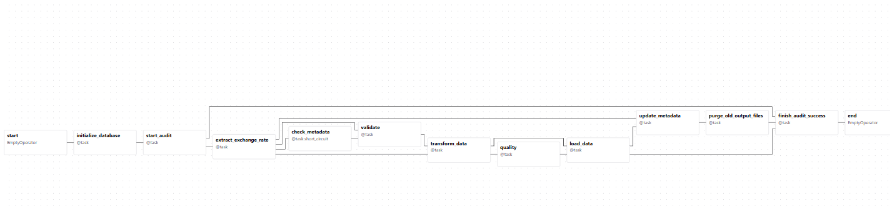
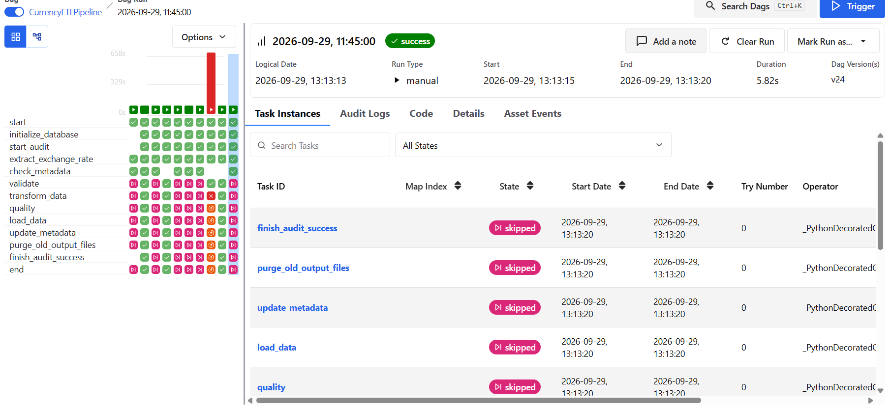

# Currency Exchange Rate ETL Pipeline using Apache Airflow

A production-inspired ETL pipeline built with **Apache Airflow 3**, **Python**, **PostgreSQL**, and **Docker** that automates the extraction, validation, transformation, and loading of daily currency exchange rates.

The pipeline supports **incremental loading**, **execution auditing**, **automatic email notifications**, and **idempotent database loading**, making it a practical demonstration of production-oriented data engineering concepts.

## Project Overview

This project is an end-to-end ETL (Extract, Transform, Load) pipeline built using **Apache Airflow 3**, **Python**, **PostgreSQL**, and **Docker**. It automatically retrieves daily currency exchange rates from the **Open Exchange Rates API (`open.er-api.com`)**, validates the API response, transforms the nested JSON data into a structured relational format, performs data quality checks, and loads the processed data into PostgreSQL.

The pipeline follows a modular architecture by separating the Extract, Validate, Transform, Quality Check, Load, Metadata, Audit, Callback, and Utility components into independent modules, making the workflow easier to maintain and extend. It incorporates production-oriented ETL practices such as **incremental loading** using an ETL metadata table and Airflow's `@task.short_circuit`, **idempotent database loading** using PostgreSQL unique constraints with `ON CONFLICT DO NOTHING`, **execution audit logging** that tracks pipeline status (`RUNNING`, `SUCCESS`, `SKIPPED`, and `FAILED`), **automatic SMTP email notifications** on task failures, and **structured logging** for monitoring and debugging.

This project was developed to gain practical experience with workflow orchestration, REST API integration, PostgreSQL, Docker, and production-style data engineering concepts.


## Features

* **Automated ETL Pipeline** – Extracts, validates, transforms, and loads daily currency exchange rates from the Open Exchange Rates API.
* **Incremental Loading** – Processes only new API data using an ETL metadata table and Airflow's `@task.short_circuit`.
* **Data Validation & Quality Checks** – Validates API responses, cleans invalid records, and enforces data quality rules before loading.
* **Idempotent Loading** – Prevents duplicate records using PostgreSQL unique constraints together with `ON CONFLICT DO NOTHING`.
* **Execution Auditing** – Tracks every pipeline run with audit logs, recording execution status (`RUNNING`, `SUCCESS`, `SKIPPED`, `FAILED`), timestamps, loaded records, and error messages.
* **Failure Handling & Notifications** – Uses Airflow callbacks to update audit logs and automatically send SMTP email notifications when tasks fail.
* **File Management** – Stores raw and processed JSON files for traceability and automatically purges old files based on configurable retention settings.
* **Monitoring & Logging** – Implements structured logging throughout the pipeline for monitoring, debugging, and troubleshooting.
* **Modular Architecture** – Organizes the project into independent Extract, Validate, Transform, Quality Check, Load, Metadata, Audit, Callback, and Utility modules for maintainability and scalability.
* **Containerized Deployment** – Runs in a reproducible environment using Docker and Docker Compose.


## ETL Pipeline Architecture

```text
                         Currency Exchange Rate ETL Pipeline

                      Open Exchange Rates API (open.er-api.com)
                                      │
                                      ▼
                            Extract Exchange Rates
                                      │
                                      ▼
                         Save Raw JSON (output/raw)
                                      │
                                      ▼
                           Create Audit Log (RUNNING)
                                      │
                                      ▼
                    Check Metadata (Incremental Loading)
                                      │
                    ┌─────────────────┴─────────────────┐
                    │                                   │
                 New Data                        No New Data
                    │                                   │
                    ▼                                   ▼
                Validate                     Update Audit (SKIPPED)
                    │                                   │
                    ▼                                   ▼
               Transform                        Pipeline Ends
                    │
                    ▼
        Save Processed JSON (output/processed)
                    │
                    ▼
           Data Quality Checks
                    │
                    ▼
          Load into PostgreSQL
                    │
                    ▼
         Update Metadata Table
                    │
                    ▼
        Update Audit log (SUCCESS)
                    │
                    ▼
      Purge Old Raw & Processed Files
                    │
                    ▼
                   End


              Any Task Failure
                      │
                      ▼
          Pipeline Failure Callback
               │               │
               ▼               ▼
 Update Audit Record      Send Email
      (FAILED)          Notification
        
```


## Workflow

The pipeline is orchestrated using Apache Airflow's TaskFlow API and consists of the following stages:

### 1. Extract

* Fetches the latest exchange rates from the Open Exchange Rates API.
* Saves the complete API response as a raw JSON file.
* Passes the raw file path to downstream tasks through Airflow.

### 2. Metadata check

* Creates the metadata table automatically if it does not exist.
* Reads the API update timestamp.
* Retrieves the last successfully processed timestamp from PostgreSQL.
* Compares both timestamps.
* Skips downstream tasks when no new source data is available.
 
### 3. Validate

* Verifies that all required fields are present (`base_code`, `time_last_update_utc`, and `rates`) with their expected data types.
* Stops the pipeline immediately if the dataset fails validation.

### 4. Transform

* Reads the validated raw JSON file.
* Performs record-level validation 
* Saves the cleaned data as a processed JSON file.

### 5. Data Quality Check

- Verifies predefined quality rules before loading.
- Stops the pipeline if any quality check fails.

### 6. Load
* Performs bulk insertion into PostgreSQL using `executemany()`.
* Prevents duplicate records using a unique constraint together with `ON CONFLICT DO NOTHING`.

### 7. Update Metadata
* Reads the API update timestamp from the raw JSON.
* Updates the etl_metadata table after successful loading.
* Stores the latest processed timestamp for future incremental loads.

### 8. Update Audit log
* Records pipeline execution details, including status (RUNNING, SUCCESS, SKIPPED, or FAILED), timestamps, loaded records, and error messages.

### 9. Failure Handling
* Executes Airflow callbacks to update the audit log and send automatic email notifications whenever a task fails.

### 10. Automatic File Retention
* Automatically removes old files from output/raw & output/processed using Airflow Variable & Airflow Execution Date(ds) based on configured retention period

## Project Structure

```text
CurrencyETLPipeline/
│
├── dags/
│   └── currency_pipeline.py          # Main Airflow DAG
│
├── include/
│   ├── callbacks/
│   │   ├── audit_callback.py
│   │   ├── email_callback.py
│   │   └── pipeline_callback.py
│   │
│   ├── extract/
│   │   └── api_client.py
│   │
│   ├── validate/
│   │   └── validator.py
│   │
│   ├── transform/
│   │   └── transform_rates.py
│   │
│   ├── quality/
│   │   └── quality_check.py
│   │
│   ├── load/
│   │   ├── database.py
│   │   ├── loader.py
│   │   ├── metadata.py
│   │   └── audit.py
│   │
│   └── utils/
│       ├── file_utils.py
│       └── purge_utils.py
│
├── output/
│   ├── raw/
│   └── processed/
│
├── logs/
├── plugins/
├── config/
│
├── docker-compose.yaml
├── Dockerfile
├── requirements.txt
└── README.md
```

# Screenshots
### Airflow DAG Graph – ETL Pipeline Execution


### Airflow Grid View – Incremental Loading (Downstream Tasks Skipped) 



## Technologies Used
- Apache Airflow 3.x
- Python 3.12
- PostgreSQL
- Docker & Docker Compose
- REST API (Open Exchange Rates API)
- JSON
- SMTP (Email Notifications)


## Database Tables
The pipeline uses the following PostgreSQL tables to store exchange rate data, incremental loading metadata, and pipeline execution audit logs.

```sql
CREATE TABLE IF NOT EXISTS exchange_rates(
    id SERIAL PRIMARY KEY,
    load_date DATE,
    source_timestamp TEXT,
    base_currency VARCHAR(10),
    target_currency VARCHAR(10),
    exchange_rate NUMERIC(20,8),
    UNIQUE(load_date,base_currency,target_currency)
    );
```

```sql
CREATE TABLE IF NOT EXISTS etl_metadata(
    pipeline_name VARCHAR(100) PRIMARY KEY,
    last_processed_timestamp TEXT,
    updated_at TIMESTAMP DEFAULT CURRENT_TIMESTAMP
)
```

```sql
CREATE TABLE IF NOT EXISTS etl_audit_log (
    id SERIAL PRIMARY KEY,
    pipeline_name VARCHAR(100) NOT NULL,
    run_id TEXT NOT NULL,
    execution_date DATE NOT NULL,
    start_time TIMESTAMP NOT NULL,
    end_time TIMESTAMP ,
    status VARCHAR(20) NOT NULL,
    records_loaded INTEGER DEFAULT 0,
    error_message TEXT
)
```

## Database Tables Description

| Table  |  Purpose                                                                     |
|--------|------------------------------------------------------------------------------|
| `exchange_rates` | Stores the processed currency exchange rates loaded from the API. |
| `etl_metadata`   | Stores the latest successfully processed API timestamp used for incremental loading. |
| `etl_audit_log`  | Records every pipeline execution, including execution status, timestamps, loaded records, and failure messages. |


## How to Run
1. Clone the repository.
2. Start the services:

```bash
docker compose up -d
```

3. Open Airflow:

```
http://localhost:8080
```

4. Enable the `CurrencyETLPipeline` DAG.

5. Trigger the DAG manually or wait for the scheduled run.

6. Verify the loaded data in PostgreSQL.

## Future Improvements

- Add automated unit and integration tests.
- Store historical pipeline metrics for monitoring.
- Visualize ETL metrics using Grafana or Apache Superset.
- Deploy the pipeline to a cloud environment (AWS, Azure, or GCP).
- Integrate CI/CD for automated testing and deployment.


